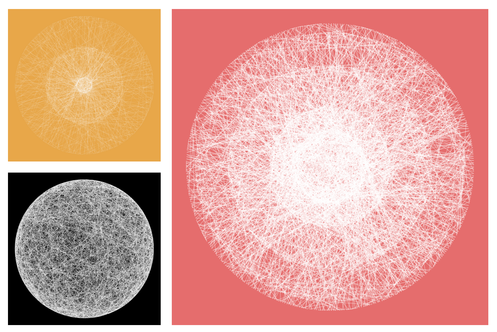
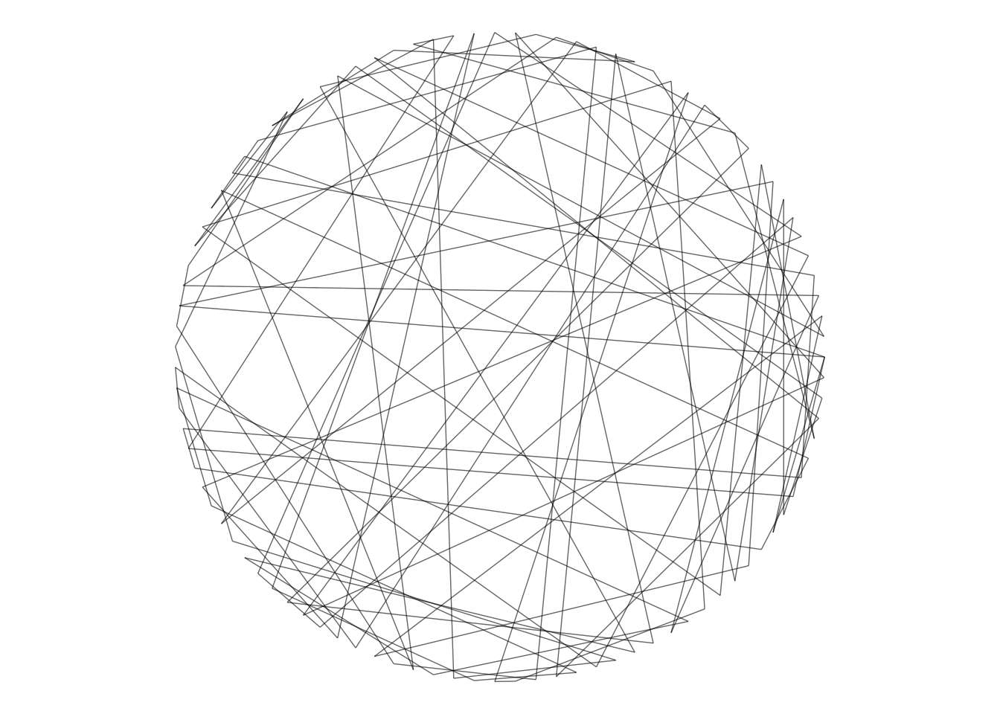

# When Two Points on a Circle Form a Line

There are many ways to produce computer created abstract images. I show you one them written in `R`, that [leads to images like these](instagram.com/cutterkom):



First of all, let's set the stage with a `config` part:

```{r warning=F, message=F}

#### load packages
#### instead of tidyverse you can also use just ggplot2, purrr and magrittr
library(here)
library(tidyverse)

####
#### Utils functions neccessary:
#### You can find them in the generativeart package on Github: github.com/cutterkom/generativeart.
#### Here they are stored in `src/generate_img.R`.
####
source(here("src/generate_img.R"))
NR_OF_IMG <- 1
LOGFILE_PATH <- "logfile/logfile.csv"

```

The principle of the underlying data is:

- forming a starting distribution
- transform the data

In this case, our starting point is a circle. I create the data with a formula called `get_circle_data()`
. The function was proposed on [Stackoverflow](https://stackoverflow.com/questions/6862742/draw-a-circle-with-ggplot2/9847076) by [Joran Elias](https://github.com/joranE).

```{r}
get_circle_data <- function(center = c(0,0), radius = 1, npoints = 100){
  tt <- seq(0, 2*pi, length.out = npoints)
  xx <- center[1] + radius * cos(tt)
  yy <- center[2] + radius * sin(tt)
  return(data.frame(x = xx, y = yy))
}
```

The circle dataframe goes straight into a `generate_data()`, where every point on the circle is connected to excatly one other point. The connections between a pair of coordinates are based on randomness, see `sample(nrow(df2))`:

```{r}
generate_data <- function() {
  print("generate data")
  df <- get_circle_data(c(0,0), 1, npoints = 100)
  df2 <- df %>%
    mutate(xend = x,
           yend = y) %>%
    select(-x, -y)
  df2 <- df2[sample(nrow(df2)),]
  df <- bind_cols(df, df2)
  return(df)
}
```

The dataframe is input to a `ggplot::geom_segment()` plotting function:

```{r}
generate_plot <- function(df, file_name, coord) {
  print("generate plot")
  plot <- df %>%
    ggplot() +
    geom_segment(aes(x = x, y = y, xend = xend, yend = yend), color = "black", size = 0.25, alpha = 0.6) +
    theme_void() +
    coord_equal()

  print("image saved...")
  plot
}
```

Now we have all parts gathered to run the wrapper function `generate_img` from the [`generativeart` package](http://github.com/cutterkom) that indeed creates an image:

```{r warning=F, message=F}
generate_img()
```



From here, you can play with the input parameters to generate different looking images.

You can change these variables in `get_circle_data()`:

* `center = c(0,0)`: changes nothing when you draw only one circle, the center can be anywhere
* `radius = 1`: numbers greater than 1 for rings within the circle
* `npoints = 100`: Higher numbers for denser circle lines.


---

## Feedback, Questions, Anything Else?

* Website: [katharinabrunner.de](katharinabrunner.de)
* Twitter: [twitter.com/cutterkom](twitter.com/cutterkom)
* Instagram: [instagram.com/cutterkom](instagram.com/cutterkom)
